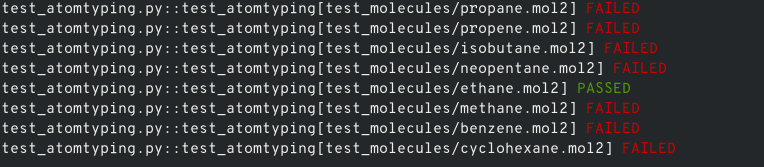
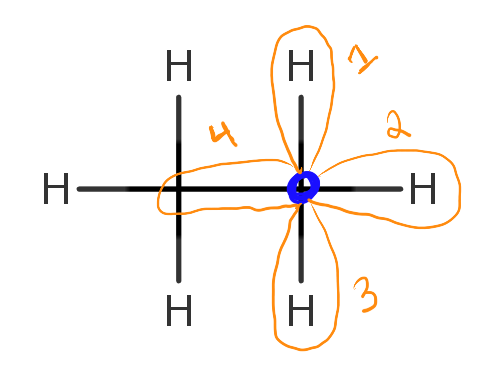
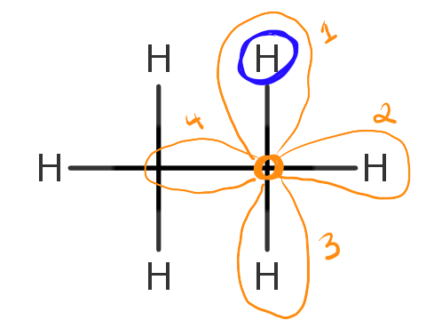
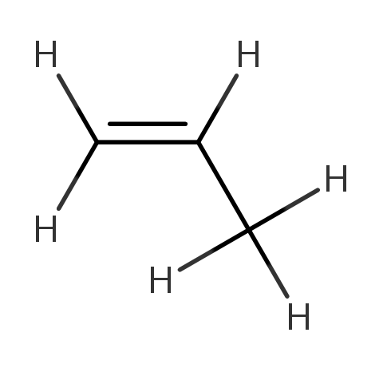
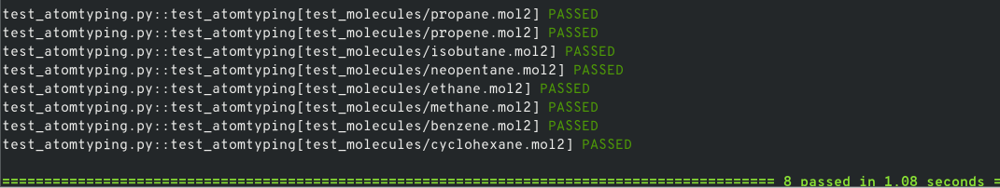

### Validating and Introducing Your Own Force Field

---

> If the current offerings for force fields do not adequately atomtype
your system, it might be time to develop and implement your own in
`Foyer`! Contained below is a brief tutorial explaining the
atomtyping process, how to validate your results, and where to share
your forcefield once complete.

#### First Steps: Atomtyping Basics and Tutorial

---

To begin, we will need to understand how `SMARTS` defines a chemical
system. This will allow us to work through the next few examples.

If you are unfamiliar with the `SMARTS` format for defining a
chemical system, please refer to [this page](http://github.com/mosdef-hub/foyer/blob/master/docs/smarts.md) and the
subsequent links within.

Armed with this knowledge of `SMARTS` and what `Foyer` has implmented,
lets begin!

1. **Initial `XML` file**

To begin, if you inspect `forcefield_template.xml`, you will notice that
the file appears to be attempting to formulate definitions for simple
alkanes, alkenes, and two types of six-member rings.

* This file format is a modification of the [OpenMM](http://docs.openmm.org/6.2.0/userguide/application.html#creating-force-fields) `XML`
 forcefield format. For more information on this format please refer to the
 link above.

*However*, the `def` term appears to be emtpy for all the definitions 
except `alkane CH3`, `alkane H`, `alkene C (RH-C=)`, `alkene C (H2-C=)`, and `alkene H`.
We will be walking through providing appropriate `SMARTS` and `Foyer`
supported definitions for these carbon hydrocarbon systems.

2. **Testing the initial `XML` file**

Before we begin editing this file, lets first test it and try to understand
how this testing and atomtyping system operates.

> We are using the `pytest` testing suite which allows for
> simple parametrization of unit tests for `python` related software.
> Visit [this](http://docs.pytest.org/en/latest/) site to better understand
> how these tests work. A few basic concepts will be touched upon, but to
> use `pytest` effectively will require more information that the link
> above readily provides.

To run your first test, run the follow instructions on your terminal
emulator of choice within this directory.
```bash
py.test -v test_atomtyping.py --tb=line
```
You should see an output similar to the one below.



Notice that all tests failed **except** for *ethane*, lets discover
why.


```python
from glob import glob

import parmed as pmd
import pytest

from foyer import Forcefield
from foyer.tests.utils import atomtype

MOL2_FILES = glob('test_molecules/*.mol2')
FORCEFIELD_FILES = glob('*.xml')

FORCEFIELD = Forcefield(forcefield_files=FORCEFIELD_FILES)

@pytest.mark.parametrize('mol2_file', MOL2_FILES)
def test_atomtyping(mol2_file):
    structure = pmd.load_file(mol2_file, structure=True)
    atomtype(structure, FORCEFIELD)
```

Lets first look at the test file `test_atomtyping.py`, the code is
displayed above for your convenience.

Starting at the line:
```python
MOL2_FILES = glob('test_molecules/*.mol2')
```
Notice that the testing file is loading in a list of all the file names
that end with the extension `.MOL2`.

Next:
```python
FORCEFIELD_FILES = glob('*.xml')

FORCEFIELD = Forcefield(forcefield_files=FORCEFIELD_FILES)
```
In the working directory where the `test_atomtyping.py` file is found,
it searches for any available `.XML` files, which are assumed to be the
forcefield files of interest. A `Foyer` forcefield is generated for the
forcefield files found.

In the steps below, one of the many `pytest` module features are
utilized. In this case, the `parametrize` function.

```python
@pytest.mark.parametrize('mol2_file', MOL2_FILES)
def test_atomtyping(mol2_file):
    structure = pmd.load_file(mol2_file, structure=True)
    atomtype(structure, FORCEFIELD)
```
The `parametrize` function allows us to generate unique unit
tests by iterating over all the possible `.MOL2` files that were
discovered by the previous lines of code. Each iteration is a separate
test that is atomtyped. This allows for very specific unit tests and
a lot of feedback to the user while also simplifying the design of the
tests themselves. If the atomtyping fails, `pytest` will inform the
user as we saw above.

**Now, lets find out why ethane passed this atom typing test.**

If we remember from earlier in this README, we saw that the
`forcefield_template.xml` `defs` were not completely empty.
The alkane CH3 and alkane H were already defined. These two atom type
definitions are all that is required to fully atom type ethane. We
will graphically show that this is true below.

3. **Applying atom typing to ethane**

Since we know that our ethane molecule is an alkane, we will assume
for the sake of this example that we do not need to test the
alkene `SMARTS` definitions in our atomtyping. Under the hood, `Foyer`
will check all relevant possibilities that could apply to each atom.

Lets first look at the two carbons within ethane. If we start at one of
the carbons and look at our nearest neighbors, we will see that we have
3 hydrogen neighbors and 1 carbon that is part of the carbon
backbone. Attached below is a image of ethane in 2d for reference.


Now lets look at the `SMARTS` string for an alkane carbon
```
def="[C;X4](H)(H)(H)C"
```
This string means that our atom of interest is a carbon atom, which has
**four** neighbors. Three of those neighbors are hydrogen branching off
of the main chain, and the fourth is a carbon that continues the main
chain.

Depending on which side, left or right, that you start from, each
carbon satisfies this definition. Both of these carbons will have
this atom type.

Shown below is an edited image of this ethane example displaying the
neighbors



The carbon of interest is shown in dark blue and its four neighbors in
orange.

Finally, lets look at the alkane hydrogen `SMARTS` string:
```
def="H[C;X4]"
```
An important distinction should be pointed out here. In a `SMARTS`
definition, the first atom in the string is the atom of interest.
This means that we are defining a definition for hydrogen in this
example. This definitions is describing a hydrogen that is bonded
to a carbon with four neighbors of any type.

If we refer to our ethane image above, we can see that each hydrogen
in this system is bonded to a carbon which has 4 neighbors. Shown below
is another graphical representation of one of these alkane hydrogens.



Our atom of interest is still shown in dark blue (hydrogen), while the
atom that is defining the `SMARTS` definition is circled in orange
(carbon) with its four neighbors contained in light orange ellipses.

We will leave the rest of the alkanes to atomtype yourself. Execute:
```bash
py.test -v test_atomtyping.py --tb=line
```
to check your progress as you add more definitions.

_Should you get stuck, please refer to the completed forcefield file
[here](../forcefield_template.xml)._

#### Alkene Atomtyping

---

Once you complete the atom typing of the alkanes, its time to try your
hand at the alkenes.

We will briefly touch on two of the examples: propene and benzene.
However, the majority of the process will be left for you to work
through as an exercise.

1. **Propene `SMARTS` string**

Once again, upon running your unit tests, you should notice that
all the alkenes fail. Alkene hydrogen has already been defined and it
follows the same pattern as the alkane hydrogen example so we will not
go through that example again. However, the alkene carbon has not been
defined yet, which we will need to fully atomtype propene.

To begin, lets look at the structure of propene below:



Looking at this structure we should be able to see what we are missing.
We do not have any descriptor for the two carbons in that double bond.

We will have to complete two definitions since we have two unique
alkene carbons in propene: one with **two** hydrogen neighbors and
one with **one** hydrogen neighbor. This is very similar to the alkane
examples, if you get stuck, please refer to the
[passing example](../forcefield_template.xml).

2. **Benzene: _rings_ and _overrides_**

When you begin developing the `SMARTS` string for benzene,
you might be wondering how you will handle
atomtyping it. If you look at your previous propene example, you
should notice that the previous alkene `SMARTS` strings you made will
atom type your benzene system.

This is an issue however as the
**chemistry** of the benzene carbons and hydrogens differ compared to
a purely alkane carbon and hydrogen one might find in propene for
example.

Fret not, as this can be handled by a combination of clever `SMARTS`
string additional options and the use of an additional flag you can
pass in the `XML` file: `overrides`.

Using `SMARTS` strings to define a six-membered carbon ring can be
easily discovered online, however, the issue will still persist that
there are conflicting atom types present.

* this can be easily handled by overriding the two alkene carbon
atom definitions
    * `overrides="opls_142,opls_143"`
    * This can be included after the `def` flag in the benzene C
    definition

You will have to override a hydrogen definition as well for the
benzene H definition.

#### **Success!**

If you successfully complete all the proper atom typing and `SMARTS`
string generation, you should see a similar result upon unit
testing.



You have completed the tutorial! Please refer back to
[this](../README.md) file for further information about contributing
your own forcefield!